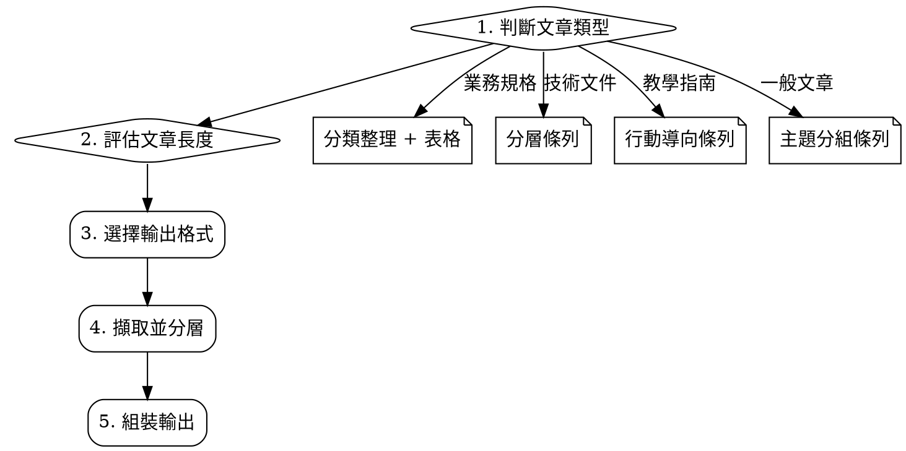

# 繁體中文重點擷取

## 概觀

從任何繁體中文文章中擷取結構化重點。核心原則：**先判斷文章類型，再選擇最適合的輸出格式，並依文章長度自動調整詳細程度。**

## 何時使用

使用者要求從繁體中文內容中擷取、整理、歸納重點時。

適用文章類型：
- 業務規格文件（SSR、FSD、UR 等）
- 技術文件（README、架構說明、API 文件）
- 教學/操作指南
- 研究報告、新聞、部落格文章
- 會議紀錄、簡報內容

不適用：
- 純程式碼（用 code review 而非重點擷取）
- 純數據表格（用資料分析）

## 輸出語言

**全程使用繁體中文**，不使用表情符號。專有名詞保留原文（如 SWIFT、API、L/C）。

## 核心流程



### 步驟 1：判斷文章類型

| 特徵 | 文章類型 |
|------|----------|
| 含規格編號、畫面功能、業務規則、欄位說明 | 業務規格 |
| 含架構、API、安裝步驟、設定說明 | 技術文件 |
| 含步驟教學、最佳實踐、使用場景 | 教學指南 |
| 其他（新聞、報告、分析、評論） | 一般文章 |

### 步驟 2：依文章長度調整詳細度

| 文章長度 | 輸出策略 |
|----------|----------|
| 短（< 500 字） | 3-5 條核心重點即可 |
| 中（500-3000 字） | 核心重點 + 補充細節，約 8-15 條 |
| 長（> 3000 字） | 完整分層：核心重點 + 分類細節 + 關鍵表格 |

### 步驟 3-5：依類型選格式、擷取、組裝

見下方各類型的輸出模板。

## 輸出結構（所有類型共用）

所有輸出**必須**以下列順序開頭：

```
## 重點整理：[文章標題或主題]

> **一句話摘要：** [用一句話說明這篇文章在講什麼]

**文章類型：** [業務規格 / 技術文件 / 教學指南 / 一般文章]
```

接著依文章類型使用對應模板。

## 類型一：業務規格文件

```
### 核心功能
- [最重要的功能，用一句話描述]
- [第二重要的功能]

### 業務規則（必須遵守）
- [關鍵規則 1]
- [關鍵規則 2]

### 系統連動
- [連動系統/交易 1]
- [連動系統/交易 2]

### 操作流程摘要
| 入口/條件 | 說明 |
|-----------|------|
| [入口 1] | [說明] |

### 補充細節
- [次要但有用的資訊]
```

**重點：** 業務規則（放行條件、金額門檻、權限限制）永遠歸為「核心」，不可放到補充。

## 類型二：技術文件

```
### 核心概念
- [這個技術/系統是什麼，一句話]
- [最重要的架構決策或設計原則]

### 關鍵技術細節
- [重要的 API / 介面 / 設定]
- [重要的限制或約束]

### 補充資訊
- [次要細節]
```

## 類型三：教學指南

```
### 核心觀念
- [這篇在教什麼，為什麼重要]

### 該怎麼做（行動清單）
1. [具體步驟或建議 1]
2. [具體步驟或建議 2]

### 避免踩坑
- [常見錯誤 1 及解法]
- [常見錯誤 2 及解法]

### 補充知識
- [背景知識或進階內容]
```

**重點：** 教學類文章必須有「該怎麼做」區塊，將建議轉為可行動的指令。

## 類型四：一般文章

```
### 核心論點
- [文章最重要的主張或發現]

### 關鍵論據 / 事實
- [支持核心論點的證據或數據]

### 延伸觀點
- [次要觀點或不同角度]
```

## 重要度分層規則

擷取重點時，依以下優先順序排列：

1. **核心（必讀）** — 不讀這些就無法理解文章主旨
   - 業務規則、系統限制、關鍵決策、核心概念
2. **重要（應讀）** — 補充核心的關鍵細節
   - 操作流程、技術細節、使用場景
3. **補充（可讀）** — 有用但非必要
   - 背景說明、歷史脈絡、邊緣案例

**每個區塊內的重點也依重要度由高到低排列。**

## 常見錯誤

| 錯誤 | 正確做法 |
|------|----------|
| 所有重點等權處理，無分層 | 必須分核心/重要/補充三層 |
| 照抄原文句子 | 用自己的話精簡重述 |
| 遺漏業務規則或限制條件 | 規則和限制永遠是核心重點 |
| 教學文章只列知識點不列行動 | 必須有「該怎麼做」區塊 |
| 開頭沒有一句話摘要 | 永遠以一句話摘要開頭 |
| 使用表情符號 | 不使用任何表情符號 |
