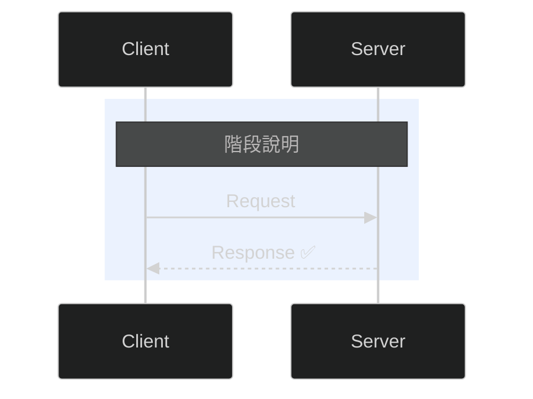
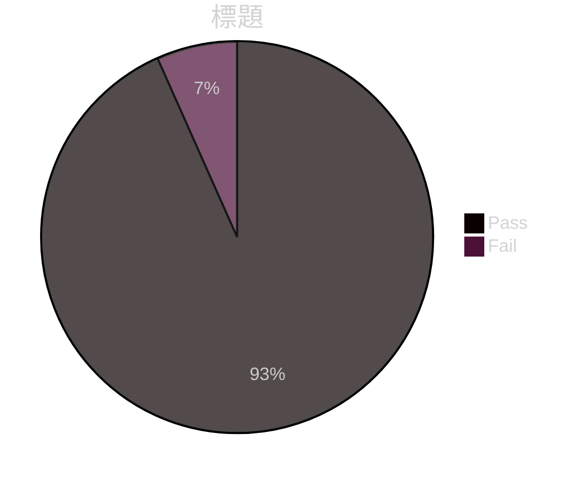

# 撰寫 POC 專案文件

## 核心原則

**每份文件只有一個讀者角色、一個核心問題。** 如果你發現一份文件同時在對工程師和主管說話，就拆開它。

## 文件矩陣

在開始寫任何文件前，先用這張表確認你在寫什麼、給誰看：

| 文件 | 讀者 | 核心問題 | 必要性 |
|------|------|---------|--------|
| `README.md` | 新工程師 | 怎麼跑起來？ | 必備 |
| `architecture.md` | 開發者 / Tech Lead | 系統怎麼運作？我該改哪裡？ | 必備 |
| `bdm-overview.md` | 非技術主管 | 有什麼價值？花多少成本？ | 必備 |
| `CHANGELOG.md` | 所有人 | 上次 demo 後改了什麼？ | 必備 |
| `optimization-plan.md` | Tech Lead | 技術債在哪？優先順序？ | 建議 |
| `runbook.md` | 維運 / QA | 失敗了怎麼辦？ | 交付時必備 |
| `security.md` | 資安 / 合規 | 資料安全嗎？ | 金融業必備 |
| `glossary.md` | 跨團隊 | S01 是什麼？這些術語什麼意思？ | 建議 |
| `CONTRIBUTING.md` | 接手工程師 | 怎麼新增功能？格式規範？ | 建議 |
| `design/adr/*.md` | Tech Lead | 為什麼這樣設計？ | 建議 |
| `analysis-report.md` | 開發者 / QA | 測試結果如何？失敗原因？ | 必備 |

## Checklist

你**必須**依序完成以下步驟：

1. **Codebase 現狀偵察（Hard Gate）** — 在寫或改任何文件之前，必須先執行：
   - 掃描專案結構：`find . -name '*.ts' -not -path './node_modules/*' | head -40`
   - 檢查自上次文件更新後哪些檔案被改過：`find . -name '*.ts' -newer <target-doc>.md -not -path './node_modules/*'`
   - 如果有 `graphify-out/`，讀取 `graphify-out/GRAPH_REPORT.md` 的 God Nodes 和 Communities，比對 architecture.md 的模組清單
   - 如果 graph 裡出現 architecture.md 沒提到的模組 → 標記為「文件落後」
   - 如有 `graphify-out/manifest.json`，比對檔案 timestamp 判斷變更範圍
   - **偵察結果必須在開始寫文件前向使用者摘要報告**
2. **盤點現有文件** — 列出已存在的 .md 檔案，標記缺失項
3. **確認讀者** — 向使用者確認這份文件的目標讀者
4. **套用對應模板** — 使用下方的文件模板
5. **自我審查** — 用下方的品質檢查表逐項驗證
6. **產出或修改文件** — 寫入檔案

## 通用寫作規則

這些規則適用於所有文件類型，不可違反：

### 結構規則

| 規則 | 做法 |
|------|------|
| 30 秒規則 | 讀者在 30 秒內要知道這份文件跟他有什麼關係 |
| 圖表先於文字 | 一張好的 Mermaid 圖 > 500 字描述 |
| 表格先於段落 | 結構化資訊用表格，敘事才用段落 |
| 連結先於重複 | 同一件事只寫在一個地方，其他地方放連結 |
| 日期必填 | 每份文件都要有「最後更新」日期 |
| 限制要寫 | 只講優點的文件沒人信 |

### 圖表規則：Mermaid 優先 + Dark Theme

**所有流程圖、架構圖、sequence diagram 一律使用 Mermaid。** 不用 ASCII art、不用外部圖片。

**每個 Mermaid code block 都必須加 dark theme init directive：**

```
%%{init: {'theme': 'dark', 'themeVariables': {'primaryColor': '#3b82f6', 'primaryTextColor': '#e2e8f0', 'lineColor': '#64748b', 'secondaryColor': '#1e293b', 'tertiaryColor': '#0f172a'}}}%%
```

**色板定義（Tailwind Slate + 語義色）：**

| 用途 | 色碼 | Tailwind 對照 | 使用場景 |
|------|------|--------------|---------|
| 主要節點背景 | `#1e293b` | slate-800 | subgraph、一般節點 fill |
| 主要節點邊框 | `#3b82f6` | blue-500 | 預設 primaryColor |
| 深背景 | `#0f172a` | slate-900 | 子節點 fill |
| 文字色 | `#e2e8f0` | slate-200 | primaryTextColor |
| 連線色 | `#64748b` | slate-500 | lineColor |
| 語義 — 成功/自動化 | `#22c55e` | green-500 | 通過、自動執行步驟 |
| 語義 — 警告/執行 | `#eab308` | yellow-500 | 注意、執行中 |
| 語義 — AI/中間步驟 | `#8b5cf6` | violet-500 | AI Agent、中間處理 |
| 語義 — 失敗/錯誤 | `#ef4444` | red-500 | 失敗、錯誤、阻塞 |
| 淺文字（搭配深背景） | `#93c5fd` | blue-300 | 藍色系子節點文字 |
| 淺文字（搭配紫色） | `#c4b5fd` | violet-300 | 紫色系子節點文字 |
| 淺文字（搭配綠色） | `#86efac` | green-300 | 綠色系子節點文字 |
| 淺文字（搭配黃色） | `#fde68a` | yellow-200 | 黃色系子節點文字 |

**不同圖表類型的範本：**

Flowchart（流程圖）：
````markdown

````

Sequence Diagram（時序圖）：
````markdown

````

Pie Chart（圓餅圖）：
````markdown

````

**Mermaid 配色禁止事項：**
- **不要用 Mermaid 預設亮色主題** — 在 dark background 上無法閱讀
- **不要省略 init directive** — 每個 code block 都要加，不能依賴全域設定
- **不要用白色或淺灰文字在淺色節點上** — 確保對比度
- **不要混用語義色** — 綠色=成功、紅色=失敗、黃色=警告，不要反過來

### 禁止事項

- **不要在 README 裡放完整架構圖** — 放連結到 `architecture.md`
- **不要在 BDM 文件裡放程式碼** — 技術細節放附錄
- **不要重複內容** — 操作步驟只出現在一個地方
- **不要用 placeholder** — Quick Start 的指令要能直接複製執行
- **不要漏預期結果** — 每個步驟都要告訴讀者「成功長什麼樣」

---

## 各文件模板與撰寫要領

### README.md — 入口文件

**讀者：** 第一次看到這個 repo 的工程師
**測試標準：** 一個新人能在 5 分鐘內跑起專案

```markdown
# 專案名稱
> 一句話說明（30 字內，講「解決什麼問題」不講技術）

## 這是什麼
2-3 句話。不講技術，講問題與價值。

## Quick Start
最短路徑跑通。不超過 5 步。每步可直接複製貼上。
每步結尾都有 ✅ 預期結果。

## 專案結構
只列第一層，每行一句話說明。不展開到第三層。

## 常用指令
| 指令 | 說明 |

## 環境變數
| 變數 | 說明 | 必填 | 預設值 |

## 延伸閱讀
- [架構設計](architecture.md)
- [BDM 概覽](bdm-overview.md)
- [故障排除](runbook.md)
```

**常犯錯誤：**
- 把架構圖塞進 README（應連結到 architecture.md）
- Quick Start 裡有分支選項（只放一條路徑）
- 環境變數說明不完整（必填/預設值都要寫）

---

### architecture.md — 開發者地圖

**讀者：** 要改程式碼的開發者
**測試標準：** 開發者看完後知道「新功能要改哪些檔案」

```markdown
# Architecture

## 系統總覽
一段話 + 一張高階 Mermaid flowchart

## 核心概念（Glossary）
| 術語 | 定義 | 範例 |
如果術語多（>10），獨立成 glossary.md

## 資料流
從輸入到輸出，每個階段：
- 輸入格式
- 處理邏輯
- 輸出格式
- 檔案位置

## 模組職責
| 模組 | 職責 | 輸入 | 輸出 | 依賴 |

## 設計決策（ADR）
### 決策：[標題]
- **背景：** 為什麼需要做決定
- **選項：** A / B / C
- **決定：** 選了什麼，為什麼
- **後果：** 這個決定帶來什麼限制

## 擴充指南
「如果我要新增一個 XXX，要改哪些檔案？」
具體步驟，不超過 7 步。
```

**常犯錯誤：**
- 沒有 ADR（三個月後你自己不知道為什麼這樣設計）
- 模組關係沒有寫「依賴什麼」「被誰依賴」
- 擴充指南放在 BDM 文件裡（應放在 architecture）

---

### bdm-overview.md — 給主管的報告

**讀者：** 不碰程式碼的非技術主管
**測試標準：** 主管看完能回答「這東西有什麼用、花多少、風險在哪」

```markdown
# 專案概覽
> 適用對象：BDM / PM / 非技術主管
> 最後更新：YYYY-MM-DD

## TL;DR（30 秒版本）
3 句話：做了什麼 → 結果如何 → 下一步是什麼

## 商業價值
| 效益 | 量化指標 |
**全部量化。** BDM 看數字不看形容詞。
❌ 「減少人工撰寫」→ ✅ 「從人工 2 天 → AI 輔助 30 分鐘」

## 運作流程
用最簡單的方塊圖。不要用技術術語。
每個方塊標明「誰做」（人工/AI/自動）。

## 目前成果
用 ✅/❌ 清單。簡潔有力。
- ✅ 已完成的具體項目
- ❌ 未完成的項目 + 原因

## 風險與待解決
| 風險 | 影響 | 緩解方案 |
BDM 最怕被 surprise。提前講清楚。

## 下一步
| 項目 | 預估時間 | 需要的資源 |
要講「你需要什麼」— 主管是來幫你排除障礙的。

## 附錄：技術細節
架構圖、流程圖放這裡。想看的人會翻到這裡。
```

**常犯錯誤：**
- 效益沒量化（用形容詞代替數字）
- 缺乏風險段落（主管被 surprise）
- 技術細節放在前面嚇人（應放附錄）
- 缺少「下一步需要什麼資源」

**倒金字塔原則：** 最重要的結論放最前面。假設主管只看前 3 段，那 3 段就要完整回答所有問題。

---

### CHANGELOG.md — 迭代紀錄

**讀者：** 所有人（demo 前會翻）
**測試標準：** 讀者能在 30 秒內知道「上次之後改了什麼」

```markdown
# Changelog

## [vX] - YYYY-MM-DD
### Added
- 新功能（用使用者能理解的語言，不是 commit message）

### Fixed
- 修復項目

### Changed
- 行為變更

### Known Issues
- 已知問題（每版都要寫，不要藏）
```

**關鍵：** 每個版本都要有 Known Issues。

---

### optimization-plan.md — 技術債追蹤

**讀者：** Tech Lead / 自己
**測試標準：** 看完知道「該先修什麼、要花多久」

```markdown
# Optimization Plan

## 狀態總覽
| 優先級 | 總數 | ✅ 完成 | 🔄 進行 | ⬜ 未開始 |

## P0 — Critical
### 0.1 標題
- **現狀：** 目前問題描述
- **原因：** 為什麼會這樣
- **修正：** 具體修法（含程式碼片段）
- **影響範圍：** 哪些檔案/模組
- **預估工時：** Xh
- **狀態：** ✅ / 🔄 / ⬜
- **完成日期：** YYYY-MM-DD（完成後填）

## 變更紀錄
| 日期 | 變更 |
```

**常犯錯誤：**
- 沒有狀態追蹤（沒有進度就是 wish list）
- 沒有工時預估（無法排進 sprint）
- 寫了就不再更新

---

### runbook.md — 故障排除

**讀者：** 維運人員 / QA / 接手的工程師
**測試標準：** 遇到問題的人能自己解決，不用找你

```markdown
# Runbook

## 環境建置（從零開始）
1. 前置條件 checklist
2. 安裝步驟（每步有預期結果）
3. 驗證環境正常

## 常見問題
### 症狀：[具體錯誤訊息或現象]
**原因：** 一句話
**解法：**
```bash
具體指令
```
**驗證：** 怎麼確認修好了

## 環境資訊
| 項目 | 值 |
| SIT endpoint | ... |
| Node 版本 | ... |
```

**格式要求：** 每個問題標題用「症狀」而非「原因」。讀者是帶著症狀來翻文件的。

---

### security.md — 資安說明

**讀者：** 資安審查人員 / 合規
**測試標準：** 資安審查時不會被擋住

```markdown
# Security Considerations

## 測試資料
- 說明測試資料是否為真實資料
- 說明 PII/敏感資料處理方式

## 敏感資訊管理
- 哪些東西不進 repo（API keys, certs, endpoints）
- 從哪裡讀取（env var / secret manager）

## 網路存取
- 存取方式（VPN/公網/私有端點）
- TLS/憑證說明

## AI / LLM 使用
- 哪些資料會送到外部 AI 服務
- 是否傳送客戶資料
- 合規確認狀態

## 已知安全限制
- 誠實列出目前的安全限制
```

**金融業必備。** 不寫這份，資安審查會擋住整個專案。

---

### glossary.md — 術語表

**讀者：** 跨團隊的所有人
**測試標準：** 新成員不用問人就能看懂其他文件

```markdown
# Glossary

| 術語 | 定義 | 出現位置 |
|------|------|---------|
| 電文 | API Request/Response 結構 | architecture.md |
```

**只收錄 domain-specific 或專案自創的術語。** 不要收錄所有人都知道的技術名詞。

---

### design/adr/*.md — 架構決策紀錄

**讀者：** 未來的自己 / Tech Lead
**測試標準：** 三個月後能得知「為什麼當初這樣選」

```markdown
# ADR-001: [決策標題]
> 日期：YYYY-MM-DD | 狀態：Accepted

## 背景
為什麼需要做這個決定？（2-3 句）

## 選項
### A: [選項名]
- 優點：...
- 缺點：...

### B: [選項名]
- 優點：...
- 缺點：...

## 決定
選了 A，因為 [具體理由]。

## 後果
- 好的後果
- 壞的後果 / 限制
```

---

## 品質自我檢查表

寫完任何文件後，逐項檢查：

| # | 檢查項目 | 適用文件 |
|---|---------|---------|
| 1 | 有「最後更新日期」嗎？ | 全部 |
| 2 | 30 秒內能知道這份文件在講什麼嗎？ | 全部 |
| 3 | 同一件事有沒有在兩份文件重複？ | 全部 |
| 4 | 效益有量化嗎？（數字，不是形容詞） | BDM |
| 5 | 風險/限制有寫嗎？ | BDM, architecture, security |
| 6 | 每步都有預期結果嗎？ | README, runbook |
| 7 | 指令能直接複製執行嗎？ | README, runbook |
| 8 | 有寫「被誰依賴 / 依賴什麼」嗎？ | architecture |
| 9 | 有 ADR 嗎？（至少 3 個決策） | architecture |
| 10 | Known Issues 有列嗎？ | CHANGELOG, optimization-plan |
| 11 | 症狀用讀者的語言寫嗎？（不是技術原因） | runbook |
| 12 | 有標明「誰做」（人工/AI/自動）嗎？ | BDM, architecture |
| 13 | 偵察步驟有執行嗎？（codebase 現狀） | 全部 |
| 14 | 文件中的數字跟 codebase 實際一致嗎？（模組數、測試案例數、API 數） | BDM, architecture, analysis-report |

## 搭配 Graphify 使用（選用）

如果專案有 `graphify-out/` 目錄，可用 graphify 作為「drift detector」：

**用途：偵察，不是產生文件。**

| 場景 | 指令 | 產出 |
|------|------|------|
| 寫文件前確認 codebase 現狀 | `/graphify . --update` | 增量更新 GRAPH_REPORT.md |
| 檢查文件是否落後 | 比對 GRAPH_REPORT 的 God Nodes vs architecture.md 的模組清單 | 差異列表 |
| 確認 API 覆蓋範圍 | 讀取 graph.json 中的 hyperedges | API 關係圖 |
| 寫 architecture.md 前理解依賴 | `/graphify query "模組依賴關係"` | 依賴路徑 |

**Graphify 不該做的事：**
- 不要用 GRAPH_REPORT.md 直接當文件交付 — 它是機器產出，可讀性不足
- 不要用 graphify 取代人工審查 — 它只告訴你「有什麼」，不告訴你「該怎麼寫」
- 不要在沒有 graphify-out/ 的專案裡要求 graphify — 那是額外成本

## 文件之間的連結規則

```
README.md
  ├── 連到 architecture.md（架構細節）
  ├── 連到 bdm-overview.md（主管報告）
  ├── 連到 runbook.md（故障排除）
  └── 連到 CHANGELOG.md（版本紀錄）

architecture.md
  ├── 連到 design/adr/（決策理由）
  ├── 連到 glossary.md（術語定義）
  └── 連到 CONTRIBUTING.md（擴充步驟）

bdm-overview.md
  └── 附錄連到 architecture.md（技術細節）
```

**檢查：** 任何文件之間不應該有環形重複。如果 A 和 B 都在講同一件事，其中一個應該改成連結。
